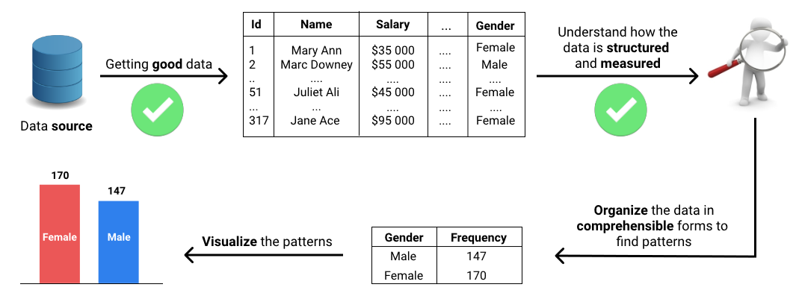

# Variables in Statistics

## Quantitative and Qualitative Variables

* Variables in statistics can describe either quantities, or qualities.
* Generally, a variable that describes how much there is of something describes a quantity, and, for this reason, it's called a quantitative variable.
* Variables that describe qualities are called qualitative variables or categorical variables. Generally, qualitative variables describe what or how something is.
* The system of rules that define how each variable is measured is called scale of measurement or, less often, level of measurement.

## Scales of Measurement

* four different scales of measurement: nominal, ordinal, interval, and ratio

## The Nominal Scale

* Specific to qualitative variables
* Nominal scale variables:
    * We can tell whether two individuals are different or not (with respect to that variable).
    * We can't say anything about the direction and the size of the difference.

## The Ordinal Scale

* Specific to quantitative variables
* Ordinal variables:
    * We can tell whether individuals are different or not
    * we can also tell the direction of the difference
    * still can't determine the size of the difference.
* Ex: Rankings 1st, 2nd, 3rd
* Ex: Survey questions asking 'Completely agree', 'mostly agree', etc

## The Interval and Ratio Scales

* A variable measured on a scale that preserves the order between values and has well-defined intervals using real numbers is an example of a variable measured either on an interval scale, or on a ratio scale.

## The Difference Between Ratio and Interval Scales

* On a **ratio** scale, the zero point means no quantity. For example, the Weight variable is measured on a ratio scale, which means that 0 grams indicate the absence of weight.
* On an **interval** scale, however, the zero point doesn't indicate the absence of a quantity. It actually indicates the presence of a quantity. (ex: temperature)

## Common Examples of Interval Scales

## Discrete and Continuous Variables

* Subdivision of variables on interval and ratio scales
* discrete - there's no possible intermediate value between any two adjacent values of a variable. Examples: counts of people in a class, a room, an office, a country
* continuous - if there's an infinity of values between any two values of a variable

## Real Limits

* The boundaries of an interval are sometimes called **real limits**. The lower boundary of the interval is called **lower real limit**, and the upper boundary is called **upper real limit**.

